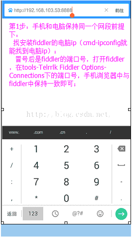
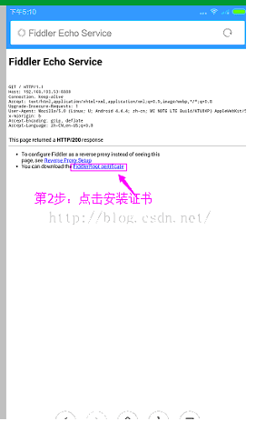
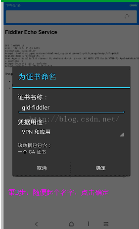
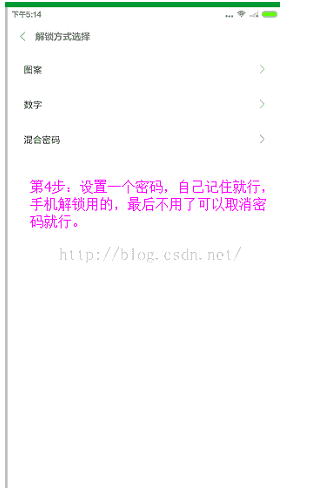

2018年 4月

## fiddler实现手机抓包教程
### 一.  对PC（笔记本）参数进行配置
#### 1. 配fiddler允许监听到https （fiddler默认只抓取http格式）
打开Fiddler菜单项Tools->TelerikFiddler Options -> HTTPS,
勾选CaptureHTTPS CONNECTs，点击Actions，
勾选Decrypt HTTPS traffic和Ignore servercertificate errors两项，点击OK（首次点击会弹出是否信任fiddler证书和安全提示，直接点击yes就行）

#### 2.配置fiddler允许远程连接
 
 上一步窗口中点击Tools->TelerikFiddler Options->Connections，勾选allow remote computers to connect，默认监听端口为8888（下图Fiddler listens on port就是端口号），若端口被占用可以设置成其他的，配置好后要重新启动fiddler，如下图：

点击完成之后，PC端配置完成，接下来开始配置手机端，以安卓为例，iOS方法同安卓；
### 二. 对手机端进行参数配置

   首先要保证手机和电脑都处于同一个网络；
   然后要知道电脑的ip地址（当然这个电脑是安装fiddler的电脑），电脑ip地址可通过cmd，输入ipconfig查询，或网络共享中ipv4找到，我的是192.168.103.53，
   再者要知道fiddler的端口号，Tools->TelerikFiddler Options->Connections，port中值就是端口号，一般默认为8888；接下来开始操作手机

#### 1.第一步：手机和电脑连接同一个网络，打开手机浏览器，输入http://ip:端口号，点击前往；见下图

#### 2. 第二步：前往之后会跳转到证书下载页，见下图：
         点击FiddlerRootcertificate下载证书；

#### 3.第三步：点击下载之后，安装证书并起个名字，随便写就行，点击确定；

#### 4.第四步：要求设置一个手机密码，自己设置一个，记住密码就行，最后不用了去系统-安全-密码中去掉即可；

#### 5.第五步：更改手机无线网的代理
         手机系统设置-无线网-点击高级，代理选择手动，主机名就是fiddler的电脑ip地址，端口号，就是fiddler的端口号，与浏览器中ip：端口号保持一致，点击确定即可，

#### 6.操作手机，电脑fiddler中会显示一些http信息，成功；

### 三.其他
1.停止电脑对手机的网络监控
         系统设置-wifi，找到代理，去掉即可；
2.删除手机中证书                       
         安卓系统设置—安全—收信任的凭证—用户，点击证书删除即可；
3.删除手机上密码
         手机系统—安全—密码，删除系统密码即可；

