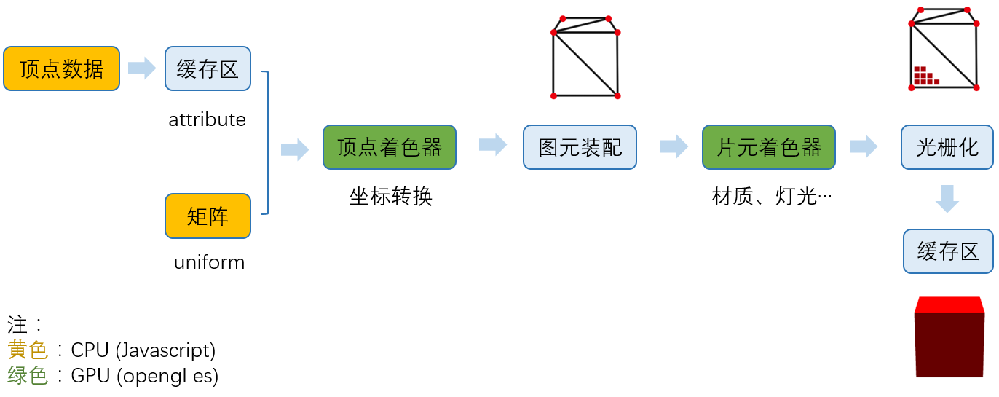

### 前端可视化---webGL

## 一、一些基本概念

- [1.1](#1.1)<a name='1.1'></a> webGL

webGL是基于OpenGL ES 2.0 的Javascript API。使得在支持HTML的canvas标签的浏览器中，不需要安装任何插件，便可使用基于OpenGL ES 2.0的API在 canvas 中进行2D和3D渲染。
WebGL程序包括用**JavaScript编写的控制代码和用OpenGL ES着色语言(GLSL ES)**编写的着色代码，后者是一种类似于C或c++的语言，在计算机的图形处理单元(GPU)上执行。（硬件3D加速渲染）

- [1.2](#1.2)<a name='1.2'></a> openGL

(Open Graphics Library)是一个用于呈现2D和3D矢量图形的跨语言、跨平台的应用程序编程接口(API)。该API通常用于与图形处理器(GPU)交互，以实现硬件加速渲染。

- [1.3](#1.3)<a name='1.3'></a> openGL与openGL ES 2.0/3.0 的区别

OpenGL 是一种可以对多种不同图形硬件设备特性进行访问的软件库。它也会迭代，--->OpenGL 2.0 ---> OpenGL 3.3 --> 等等

OpenGL ES 2.0 是为了满足嵌入式设备使用（嵌入式计算机，智能手机，家用游戏机等设备）的特殊版本。---->>迭代为 OpenGL ES3.0

OpenGL ES 2.0 是OpenGL的子集

- [1.4](#1.4)<a name='1.4'></a> webGL 和 canvas 以及 svg 的区别

#### Canvas 位图，是需要自己画点的白板。

```html
<!-- 举例说明 被填充为红色背景的三角形 -->
<body>
  <canvas id="myCanvas"></canvas>
  <script>
    var cv=document.getElementById('myCanvas')
    var context=cv.getContext('2d')
    context.fillStyle="red"; //设置填充颜色
    context.moveTo(150,50); //设置起点为(150,50)
    context.lineTo(250,250); //下一点的坐标设为（150，150）
    context.lineTo(50,250); //下一点的坐标设为（50，150）
    context.fill(); //填充颜色，因为会整个图像填充，所以可以有closePath(),也可以没有
  </script>
</body>
```

[Canvas API](https://bucephalus.org/text/CanvasHandbook/CanvasHandbook.html)

####  SVG 矢量图，是给数据就可以绘制点、线、图形的，基于XML 的标记语言。

```xml
<svg version="1.1"
     baseProfile="full"
     width="300" height="200"
     xmlns="http://www.w3.org/2000/svg">
  <rect width="100%" height="100%" fill="red" /> <!-- 被填充红色的矩形-->
  <circle cx="150" cy="100" r="80" fill="green" /> <!-- 半径为80的圆形 -->
  <text x="150" y="125" font-size="60" text-anchor="middle" fill="white">SVG</text> <!-- 白色居中的文字 -->
</svg>
```

svg 说明文档链接

#### WebGL 3D 位图，是基于 Canvas 的 3D 框架

- [1.5](#1.5)<a name='1.5'></a>可视化的几种方式及性能对比

1. html + css：缺点：为完成页面渲染工作，除了绘制图形外，还做了其他很多额外工作，解析html，css，svg，构建DOM树，RenderObject树和RenderLayer树，然后用html(svg)绘图，
当图形发生变化时，要重新执行全部的工作，这样性能开销非常大。

2. svg：缺点：和html一样 同样会有引擎解析，布局计算和渲染树生成的性能开销，同时如果展示的图形很复杂，会有大量的svg元素会占用更多的内存空间，以及相对更大的性能开销。
   
3. canvas 2d：canvas 提供了非常丰富的设置和绘图API，缺点：处理大量的像素计算时，会遇到性能瓶劲，屏幕适配和处理文本方面也不太友好

4. webGL：使用GPU能力，计算的像素点非常多，或绘制3d物体，都可采用

## 二、webGL examples

webglAPI：能绘制点（gl.POINTS），线（gl.LINES），三角形（gl.TRIANGLES）
任何复杂的模型，都是一个个三角形画出来的。

- [2.1](#2.1)<a name='2.1'></a> 设置背景色

[代码参考](./webgl-examples/sample1/index.html)

- [2.2](#2.2)<a name="2.2"></a> 绘制点

[代码参考](./webgl-examples/sample2/index.html)

- [2.3](#2.3)<a name="2.3"></a> 绘制正方形

[代码参考](./webgl-examples/sample3/index.html)
  
- [2.4](#2.4)<a name="2.4"></a> 绘制正方体 // 能不能忽略

## 三、webGL的流程原理

### 1. 获取顶点坐标
   
顶点坐标往往来自三维软件导出，或者是框架生成，获取到顶点坐标后，通常会将它存储在缓存区，方便GPU更快读取。


### 2. 图元装配

图元装配就是由是顶点生成一个个图元（即三角形）。顶点着色器会先将坐标转换完毕，然后由GPU进行图元装配。


有多少个顶点，顶点着色器代码就会执行多少次

```js
const vertexShader=`
   attribute vec4 a_position;
   void main () {
       // gl_Position为内置变量，表示当前点的位置
       gl_Position = a_position;
       // gl_Position为内置变量，表示当前点的大小，为浮点类型，如果赋值是整数类型会报错
       gl_PointSize = 10.0;
   }  
 `;
```

### 3. 光栅栏化

生成一个个像素点的过程

在图元生成完毕之后，我们需要给模型“上色”，而完成这部分工作的，则是运行在GPU的“片元着色器”来完成。

它同样是一段opengl es程序，模型看起来是什么质地（颜色、漫反射贴图等）、灯光等由片元着色器来计算。【片元着色器处理过程】


一个像素就会执行一次片元着色器代码

```js
const fragmentShader=`
  // 设置浮点数精度
  precision mediump float;
  void main () {
       // vec4是表示四维向量，这里用来表示RGBA的值[0~1]，均为浮点数，如为整数则会报错
       gl_FragColor = vec4(1.0, 0.5, 1.0, 1.0);
   }
`;
```

### 4. 完整的流程



1. 准备数据阶段
2. 生成顶点着色器
根据需要，由Javascript定义一段顶点着色器程序的字符串，生成并编译成一段着色器程序传递给GPU。
3. 图元装配
GPU根据顶点数量，挨个执行顶点着色器程序，生成顶点最终的坐标，完成坐标转换。
4. 生成片元着色器
模型是什么颜色，看起来是什么质地，光照效果，阴影，都在这个阶段处理。
5. 光栅栏化
将通过片元着色器，获得的片元信息存储到颜色缓存区，最终完成这个渲染。

参考 [webGL工作原理](https://www.cnblogs.com/wanbo/p/6754066.html)

## 四、Three.js 的简单使用

## 五、其他知识点

1. 基于webGL 延伸出来了部分开源库
- [glMatrix](https://github.com/toji/gl-matrix) 创建高性能WebGL应用的JavaScript矩阵矢量库。
- [Babylon.js](https://www.babylonjs.com/) 一个用于数据可视化、创意编程和游戏开发的WebGL库。
- [Pixi.js](https://pixijs.com/) 是一种快速的开源2D WebGL渲染器。
- [three.js](https://threejs.org/) 是一个开源的，功能齐全的3D WebGL库。

## 六、参考文档
- [文档一](https://developer.mozilla.org/zh-CN/docs/Web/API/WebGL_API/Tutorial/Adding_2D_content_to_a_WebGL_context)
- [文档二](https://github.com/mdn/webgl-examples/blob/gh-pages/tutorial/sample2/webgl.css)